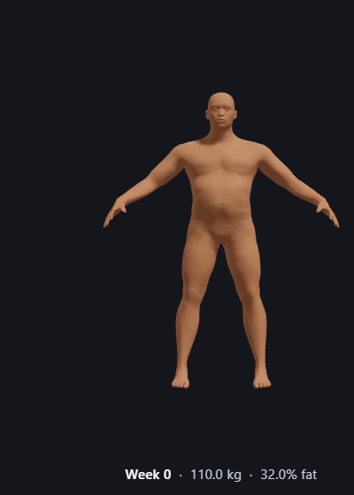
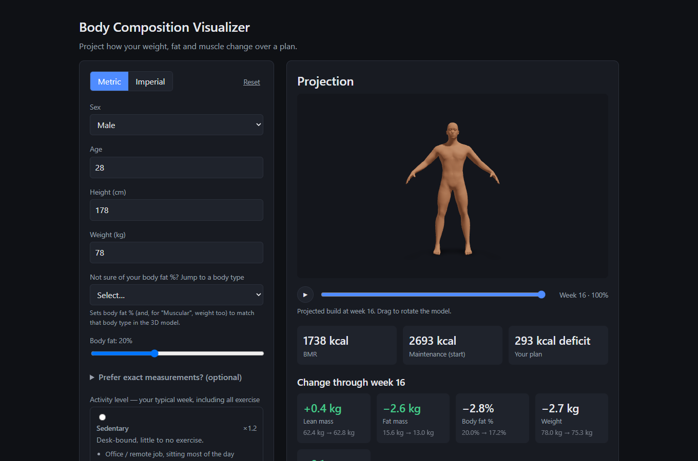

# Body Composition Visualizer

[](https://github.com/r-capuzzi/body-composition-visualizer/actions/workflows/test.yml)

**Live demo: [body-composition-visualizer.vercel.app](https://body-composition-visualizer.vercel.app)**
*(the free-tier backend sleeps when idle, so the first projection can take ~30 s; after that it's instant)*

Enter your stats and a plan (calories, training, protein, duration). The app
projects how your weight, fat and muscle change week by week, and shows the
result on a 3D body you can scrub through time.

<p align="center">
  
</p>
<p align="center"><sub>A real projection from the backend: a 52-week cut, 110 kg at 32% body fat → 88 kg at 18%.</sub></p>



## What's interesting here

**A projection model built from published research, not a calorie calculator.**
The backend simulates the plan one week at a time and returns expected,
conservative and optimistic scenarios. Every constant in
[`backend/calculations.py`](backend/calculations.py) cites its source:

- **Resting metabolism:** Mifflin-St Jeor blended with Katch-McArdle.
- **Tissue energy:** fat and lean tissue have different energy densities, so they're modelled separately rather than with a flat 7,700 kcal/kg.
- **Muscle gain limits by training age:** Aragon; Helms, *Muscle & Strength Pyramid*.
- **Muscle loss in a deficit:** Murphy & Koehler 2022.
- **Training frequency:** Schoenfeld meta-analyses.
- **Metabolic adaptation:** Trexler et al. 2014.
- **Energy partitioning:** Forbes; Hall.

It's deliberately conservative: a user should beat the projection, not fall short of it.

**A 3D body checked against measured people.** The avatar is a real
[MakeHuman](http://www.makehumancommunity.org/) mesh with muscle and fat morph
targets, blended on the CPU with exact normals. What makes it more than a
slider toy is that its measurements are tested against real data:

- **Obese adults:** at the average size of a measured cohort (Wiggermann et al. 2019, *Human Factors*), its chest, waist, hips and shoulders land within 6%. A single "scale everything by weight" factor was 10–24% off, which led to the abdomen widening faster than the rest of the body.
- **The average US adult:** at CDC/NHANES size, the waist lands within 8%.
- **The neutral point:** the base meshes' own body fat comes from the Relative Fat Mass formula (Woolcott & Bergman 2018).
- **Muscle vs. fat-driven lean mass:** the lean mass that simply comes with carrying fat (Forbes's curve) isn't shown as muscle, so obese bodies don't render as bodybuilders.

**Real tape measurements, applied smoothly.** You can type shoulder, chest,
waist, hip or arm measurements.
- **Calibration:** they're calibrated against the model's estimate for *your* body, so they render exactly at the start and carry through every week of the projection.
- **No seams:** the torso is separated from the arms by a flood fill over the mesh, and the tests fail if any edge stretches enough to tear.

## Architecture

- **`backend/`** — FastAPI + Pydantic. Validates the inputs, runs the weekly
  simulation (`projection.py` over `calculations.py`), and returns the three
  scenarios plus plan warnings. No database.
- **`frontend/`** — React 19 + Vite. The form updates the projection live, with
  no submit button. Recharts draws the chart; the avatar is Three.js via React
  Three Fiber.
  - `lib/bodyMesh.js` loads the meshes, finds anatomical landmarks and segments the body.
  - `lib/bodyShape.js` is the pure shaping maths (morph blend, measurement overrides, per-region width), kept out of the component so it's testable without WebGL.
  - `lib/bodyParams.js` maps a projected body (weight, fat, lean mass) to morph inputs.

Deployed on **Vercel** (frontend) and **Render** (backend), both auto-deploying
from `master`. **CI** runs the backend tests on Python 3.11 and 3.14 and the
frontend tests and build on Node 24.

## Running it locally

**Backend** (from `backend/`, with a Python venv active):

```bash
pip install -r requirements.txt
python -m uvicorn main:app --reload
```

Serves `http://localhost:8000`, with interactive docs at `/docs`. Set
`ALLOWED_ORIGINS` to add a deployed frontend to CORS (see `backend/.env.example`).

**Frontend** (from `frontend/`):

```bash
npm install
npm run dev
```

Serves `http://localhost:3000`, pinned to match the backend's default CORS
allowlist. Set `VITE_API_BASE` to use a deployed backend (see
`frontend/.env.example`). How to rebuild the 3D body assets from MakeHuman
exports is in [`frontend/README.md`](frontend/README.md).

## Tests

```bash
cd backend && python -m pytest -q     # 50 tests
cd frontend && npm test                # 96 tests, including the real-mesh checks
```

## Tech stack

Python · FastAPI · Pydantic · pytest · React 19 · Vite · Three.js · React Three
Fiber · drei · Recharts · Vitest · GitHub Actions · Vercel · Render
